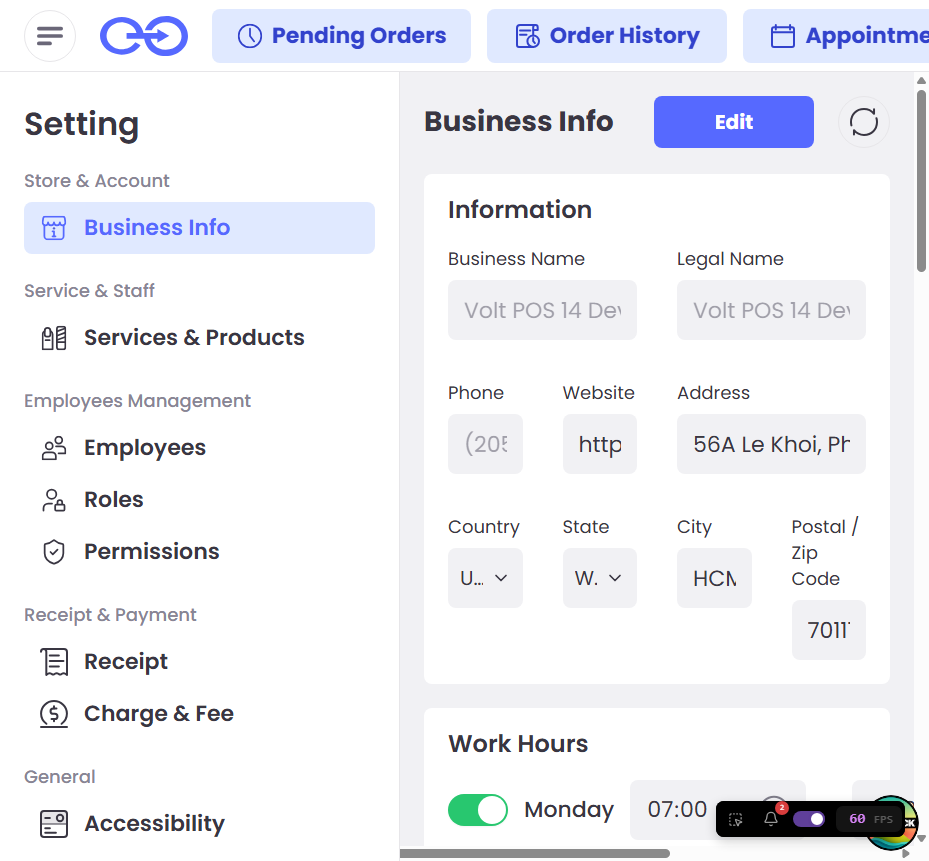

# Thông tin doanh nghiệp (`/settings/business`) — Tài liệu hợp nhất

> MỘT file duy nhất: gộp đặc tả tính năng + test case + kết quả quét Tiếng Việt (còn tiếng Anh + dịch đúng chuẩn). Kết quả trực quan: reports/settings-business/settings-business.html. Luồng code-gen giữ riêng: codegen-flow/settings-business-flow.md · codegen-detail/settings-business-detail.md.

# PHẦN A — Đặc tả tính năng

## A1. Mục tiêu & phạm vi

Màn **Cài đặt → Cửa hàng & Tài khoản → Business Info**: xem & chỉnh thông tin doanh nghiệp của tiệm — hồ sơ, giờ làm việc, kỳ trả lương, thương hiệu (logo/ảnh bìa) và chính sách cửa hàng. Là màn **gated** (yêu cầu passcode chủ `8888` khi vào).

- Nguồn Linear: **VP-871** (General Settings — Business Profile tab, portal-legacy) + offline `docs/linear/settings.md`
- Quét bằng playwright-mcp (live scan localhost:1420)

## A2. Các luồng chính

- **Xem hồ sơ:** vào màn (qua passcode gate) → thấy thông tin điền sẵn từ merchant settings.
- **Chỉnh sửa:** bấm **Edit** → mở khoá các ô cho phép sửa → **Save** / **Cancel** (Cancel reset về giá trị đã lưu).
- **Cấu hình giờ làm:** bật/tắt từng ngày (switch) + chọn giờ mở/đóng; ngày tắt hiển thị "Closed".
- **Kỳ trả lương (Pay Period):** chọn Weekly/Biweekly/Monthly/Custom; hỗ trợ **lịch đổi kỳ** (scheduled change — hiệu lực đầu kỳ kế, không áp ngay).
- **Thương hiệu:** upload Store Logo + Cover Photo (PNG/JPG ≤ 5MB — theo VP-871).
- **Chính sách:** nhập Liability / Cancellation / Other Policies (khách xác nhận khi check-in/out).

## A3. Thành phần UI thực tế (quét Playwright MCP)

| Nhóm           | Thành phần                                           | Vai trò                         | Trạng thái/Ghi chú                                                      |
| -------------- | ---------------------------------------------------- | ------------------------------- | ----------------------------------------------------------------------- |
| Gate           | Dialog "Enter your passcode"                         | Cổng owner passcode             | keypad 0–9 + checkbox "Do not require passcode for the next 30 minutes" |
| Header         | `Business Info` + nút **Edit** + nút icon            | Tiêu đề + vào chế độ sửa        |                                                                         |
| Information    | Business Name, Legal Name, Phone                     | Ô nhập                          | **disabled** (read-only; sửa cần admin — VP-871)                        |
| Information    | Website, Address, City, Postal/Zip Code              | Ô nhập                          | editable                                                                |
| Information    | Country, State                                       | Combobox                        | mặc định United States / Wyoming                                        |
| Work Hours     | 7 switch (Mon–Sun) + 2 ô giờ mở/đóng mỗi ngày        | Bật/tắt + giờ                   | Sunday tắt → ô "Closed" (disabled)                                      |
| Pay Period     | Card "Current plan" + "Scheduled change"             | Hiển thị kỳ hiện tại & lịch đổi | vd Jul 01–Jul 23; đổi hiệu lực Jul 24                                   |
| Pay Period     | Radio Weekly/Biweekly/Monthly/Custom + nút chọn ngày | Chọn kiểu kỳ lương              | Custom → nút "23, 25, 26, 31"                                           |
| Pay Period     | Ghi chú scheduled                                    | Thông báo áp dụng kỳ kế         | "This is scheduled, not applied now…"                                   |
| Store Brand    | Store Logo, Cover Photo (Preview)                    | Upload ảnh thương hiệu          | PNG/JPG ≤5MB (VP-871)                                                   |
| Store Policies | Liability / Cancellation / Other Policies            | Ô nhập chính sách               | placeholder "Enter your policies"                                       |

## A4. Nghiệp vụ & ràng buộc

- **Read-only theo quyền:** Business Name, Legal Name, Phone khoá (chỉ admin sửa — VP-871). Muốn đổi tên/địa chỉ pháp lý → liên hệ Fastboy support.
- **Upload:** logo & cover PNG/JPG, tối đa 5MB (VP-871).
- **Pay Period scheduled:** thay đổi kỳ lương **không áp ngay** — có hiệu lực đầu kỳ kế; kỳ hiện tại giữ nguyên.
- **Save/Cancel:** Cancel reset form về lần lưu gần nhất.

## A5. Trạng thái / quyền / edge case

- **Gated:** vào màn phải nhập passcode `8888` (env `OWNER_PASSCODE`); tick "30 phút" để khỏi hỏi lại.
- **Sunday/ngày nghỉ:** switch tắt → giờ hiển thị "Closed", ô giờ disabled.
- **Scheduled change:** khi có lịch đổi kỳ lương → hiện card riêng + ghi chú.
- **i18n:** bản Tiếng Việt **sạch** (70 thuật ngữ đúng, 0 chưa dịch) — xem PHẦN B.

## A6. Đối chiếu Linear ↔ UI thực tế

| Mục                                               | Linear (VP-871, portal) | UI thực tế (POS)            | Kết luận                                   |
| ------------------------------------------------- | ----------------------- | --------------------------- | ------------------------------------------ |
| Hồ sơ (Name/Legal/Address/Contact/Website)        | ✅ mô tả                | ✅ có                       | **khớp**                                   |
| Business Hours                                    | ✅                      | ✅ (7 ngày + giờ)           | **khớp**                                   |
| Logo + Welcoming/Cover                            | ✅ (≤5MB)               | ✅ Store Logo + Cover Photo | **khớp**                                   |
| Contact CRM table (view-only)                     | ✅ mô tả                | ❌ **không thấy** trên POS  | **lệch** — chỉ có ở Portal legacy          |
| **Pay Period** (Weekly/…/Custom + scheduled)      | ❌ không nêu            | ✅ có trên POS              | **lệch** — POS bổ sung, chưa có spec riêng |
| **Store Policies** (Liability/Cancellation/Other) | ❌ không nêu            | ✅ có trên POS              | **lệch** — cần bổ sung spec                |
| Cổng passcode                                     | ❌ không nêu            | ✅ owner passcode gate      | **lệch** — cần ghi vào spec                |

> VP-871 thuộc project **Portal (legacy)** nên mô tả hồ sơ khớp, nhưng **Pay Period / Store Policies / passcode gate** là phần POS bổ sung — đề xuất tạo spec Linear cho màn POS Business Info.

# PHẦN B — Quét Tiếng Việt (i18n)

## B0. Tổng quan (số liệu từ i18n-result.md / compare.json)

> **Chuỗi UI đối chiếu 70** · ❌ chưa dịch **0** · ⚠️ sai chuẩn **0** · 📐 UI vỡ **0** · ✅ thuật ngữ đúng **70** · (data bỏ qua: 2 · tổng pair 89)
> Quét EN↔VI **sau khi cuộn hết trang** (`scrollThroughPage`). 🎉 **Không còn tiếng Anh & không sai chuẩn** trên view mặc định.

Số liệu thô từ `reports/settings-business/compare.json` (`generatedAt` 2026-07-06T10:34:31Z): `total 94 · missing 0 · suspect 0 · ok 74 · data 3`. Các mục `status: "missing"` trong JSON đều là **aria-label kỹ thuật / placeholder số / giá trị data** (Device ID, version, số điện thoại mẫu, "Open sidebar", "Open on monday"…) chứ không phải nhãn UI dịch được → i18n-result quy về **0 nhãn UI còn tiếng Anh**.

> Report trực quan: `reports/settings-business/compare.html`

## B1. ❌ Còn tiếng Anh (nhãn UI thật)

> Không có. 0 nhãn UI hiển thị còn tiếng Anh trên view mặc định.

## B2. ⚠️ Dịch chưa đúng chuẩn

> Không có. 70/70 thuật ngữ khớp glossary (view mặc định).

## B3. ✅ Đã dịch đúng (mẫu)

| EN                                   | VI                                                    |
| ------------------------------------ | ----------------------------------------------------- |
| Business Info                        | Thông tin doanh nghiệp                                |
| Edit                                 | Sửa                                                   |
| Information                          | Thông tin                                             |
| Business Name                        | Tên doanh nghiệp                                      |
| Legal Name                           | Tên pháp lý                                           |
| Phone                                | Điện thoại                                            |
| Address                              | Địa chỉ                                               |
| Country                              | Quốc gia                                              |
| State                                | Tiểu bang                                             |
| City                                 | Thành phố                                             |
| Postal / Zip Code                    | Mã bưu chính                                          |
| Work Hours                           | Giờ làm việc                                          |
| Monday / … / Sunday                  | Thứ Hai / … / Chủ Nhật                                |
| Pay Period                           | Kỳ trả lương                                          |
| Current plan                         | Kỳ hiện tại                                           |
| Scheduled change                     | Thay đổi đã lên lịch                                  |
| Effective on Jul 24, 2026            | Áp dụng từ Jul 24, 2026                               |
| Weekly / Biweekly / Monthly / Custom | Hàng tuần / Hai tuần một lần / Hàng tháng / Tuỳ chỉnh |
| This is scheduled, not applied now.  | Đây là lịch thay đổi, chưa áp dụng.                   |
| Store Brand                          | Thương hiệu cửa hàng                                  |
| Store Logo                           | Logo cửa hàng                                         |
| Cover Photo                          | Ảnh bìa                                               |
| Store Policies                       | Chính sách cửa hàng                                   |
| Liability Policies                   | Chính sách trách nhiệm                                |
| Cancellation Policies                | Chính sách huỷ                                        |
| Other Policies                       | Chính sách khác                                       |
| [placeholder] Enter your policies    | Nhập chính sách của bạn                               |

## B4. 📐 UI vỡ (chỉ báo cáo)

> Không phát hiện: `xOverflow = 0px`, không có chuỗi bị cắt (`clipped = []`).

**Ghi chú / đề xuất bổ sung glossary:**

- View mặc định sạch. Nếu màn có **popup / dialog / form con** (thêm/sửa) → cần deep-scan bổ sung (mở dialog rồi quét) để phủ 100%.
- Chưa có sub-task Linear nào (VP-2252) chỉ đích danh màn này.

# PHẦN C — Test cases

> Tiền đề chung: app chạy `localhost:1420`, đã đăng nhập. Màn **gated** → nhập passcode `8888`.
> Phạm vi: **read-only / verification** (KHÔNG bấm Save để tránh đổi dữ liệu backend dùng chung).

| ID        | Tiêu đề                    | Tiền điều kiện        | Các bước                                       | Kết quả mong đợi                                                                                         | Loại       | Ưu tiên |
| --------- | -------------------------- | --------------------- | ---------------------------------------------- | -------------------------------------------------------------------------------------------------------- | ---------- | ------- |
| TC-BIZ-01 | Cổng passcode hiện khi vào | chưa unlock           | 1. Vào `/settings/business`                    | Dialog "Enter your passcode" hiện (keypad + checkbox 30')                                                | regression | P1      |
| TC-BIZ-02 | Unlock bằng passcode đúng  | dialog đang hiện      | 1. Tick "30 phút" 2. Nhập `8888`               | Dialog đóng, form Business Info hiện                                                                     | regression | P1      |
| TC-BIZ-03 | Tiêu đề & các section      | đã unlock             | 1. Quan sát                                    | Có heading "Business Info" + 5 section: Information, Work Hours, Pay Period, Store Brand, Store Policies | regression | P1      |
| TC-BIZ-04 | Field hồ sơ hiển thị       | đã unlock             | 1. Xem khối Information                        | Có các ô: Business Name, Legal Name, Phone, Website, Address, Country, State, City, Postal/Zip           | regression | P2      |
| TC-BIZ-05 | Field khoá theo quyền      | đã unlock (chưa Edit) | 1. Kiểm tra Business Name / Legal Name / Phone | 3 ô này **disabled** (read-only)                                                                         | regression | P1      |
| TC-BIZ-06 | Field cho phép sửa         | đã unlock             | 1. Kiểm tra Website / Address / City           | Các ô này **editable**                                                                                   | regression | P2      |
| TC-BIZ-07 | Nút Edit tồn tại           | đã unlock             | 1. Xem header                                  | Nút "Edit" hiển thị & bấm được                                                                           | regression | P2      |
| TC-BIZ-08 | Work Hours 7 ngày          | đã unlock             | 1. Xem Work Hours                              | Có switch cho monday…sunday; ngày mở có 2 ô giờ                                                          | regression | P2      |
| TC-BIZ-09 | Ngày nghỉ = Closed         | đã unlock             | 1. Tìm ngày switch off (Sunday)                | Hiển thị "Closed", ô giờ disabled                                                                        | regression | P3      |
| TC-BIZ-10 | Pay Period đọc được        | đã unlock             | 1. `readPayPeriod()`                           | Trả về type ∈ {Weekly,Biweekly,Monthly,Custom}; Custom có danh sách ngày                                 | regression | P1      |
| TC-BIZ-11 | Store Policies fields      | đã unlock             | 1. Xem Store Policies                          | Có 3 ô: Liability / Cancellation / Other Policies                                                        | regression | P3      |
| TC-BIZ-12 | i18n VN sạch               | app đang VN           | 1. Đối chiếu compare                           | 0 chuỗi tiếng Anh trên màn (xem PHẦN B)                                                                  | regression | P2      |

## Nguồn tham chiếu

- Spec/glossary: `../settings-business/settings-business-code-detail.md (i18n Notes section)` (nếu có, giữ riêng)
- Luồng code-gen (tách riêng): [../settings-business/settings-business-code-detail.md](../settings-business/settings-business-code-detail.md) · [../settings-business/settings-business-code-detail.md](../settings-business/settings-business-code-detail.md)
- Test/helper + dữ liệu thô JSON: `../../reports/settings-business/compare.json` · `../../reports/settings-business/compare.html`
- Glossary/registry: [../../src/utils/i18nCompare.ts](../../src/utils/i18nCompare.ts) (`SCREENS['settings-business']`)
- Linear: [VP-871](https://linear.app/fastboy/issue/VP-871) · offline `docs/linear/settings.md`
- Ảnh quét: `settings-business-assets/business-info.png`
